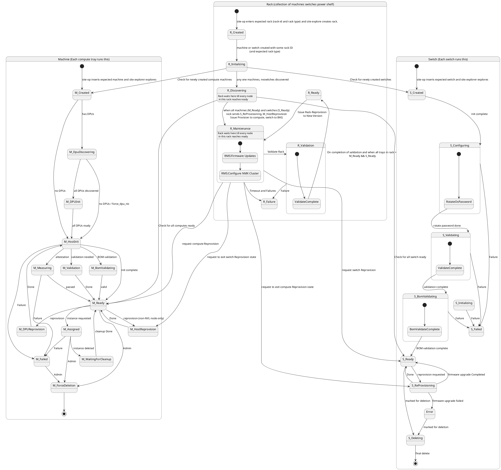
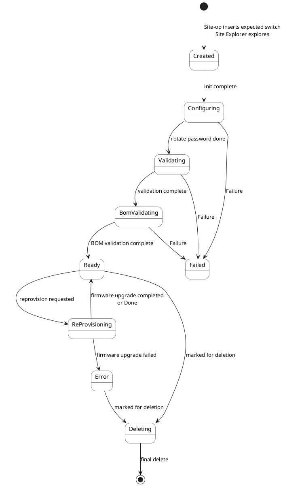
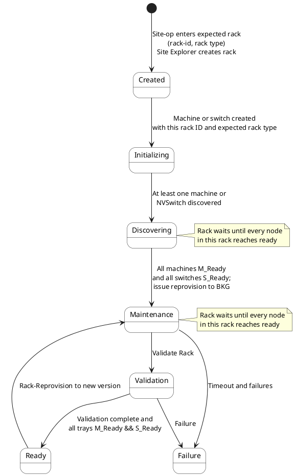

# Rack State Machine interaction with Machine, Switch

This document defines the combined state machines for **Machine** (each compute tray / managed host lifecycle), **Switch** (each switch), and **Rack** (collection of machines, switches, and power shelf). The diagram below shows all three and the transitions between the Rack state machine and the Machine/Switch state machines.

## Combined State Diagram (Machine, Switch, Rack)



---

## Switch State Machine Flow

The **Switch** state machine runs on each switch. The lifecycle runs from creation (site-op inserts expected switch, Site Explorer explores) through configuration (OS password rotation), validation, BOM validation, to Ready. From Ready a switch can be marked for deletion, or enter ReProvisioning (e.g. when the Rack requests firmware upgrade); reprovision can complete back to Ready or fail to Error and then Deleting.

### Switch High-Level Flow

<div style="width: 180%; background: white; margin-left: -40%;">
<!-- Keep the empty line after this or the diagram will break -->


</div>

### Switch State Definitions

#### Created (S_Created)

- **Entry:** Site operator inserts the expected switch; Site Explorer explores and creates the switch entity.
- **Exit:** When initialization is complete, the switch moves to **Configuring**.

#### Configuring (S_Configuring)

- **Entry:** From Created when init is complete.
- **Exit:**  
  - To **Validating** when OS password rotation is done.  
  - To **Failed** on any failure.

**Substate:** RotateOsPassword — rotates the OS password as part of initial configuration.

#### Validating (S_Validating)

- **Entry:** From Configuring when rotate password is done.
- **Exit:**  
  - To **BomValidating** when validation is complete.  
  - To **Failed** on any failure.

**Substate:** ValidateComplete — represents completion of the validation step.

#### BomValidating (S_BomValidating)

- **Entry:** From Validating when validation is complete.
- **Exit:**  
  - To **Ready** when BOM validation is complete.  
  - To **Failed** on any failure.

**Substate:** BomValidateComplete — represents completion of BOM validation.

#### Ready (S_Ready)

- **Entry:** From BomValidating when BOM validation is complete.
- **Exit:**  
  - To **Deleting** when marked for deletion.  
  - To **ReProvisioning** when reprovision is requested (e.g. by Rack for firmware upgrade).

The switch is fully operational. The Rack state machine checks for all switches in S_Ready when moving from Discovering to Maintenance and from Maintenance to Validation/Ready.

#### ReProvisioning (S_ReProvisioning)

- **Entry:** From Ready when reprovision is requested (e.g. Rack issues S_ReProvisioning for firmware upgrade).
- **Exit:**  
  - To **Ready** when firmware upgrade completes (or Done).  
  - To **Error** when firmware upgrade fails.

#### Error

- **Entry:** From ReProvisioning when firmware upgrade fails.
- **Exit:** To **Deleting** when marked for deletion.

#### Deleting (S_Deleting)

- **Entry:** From Ready when marked for deletion, or from Error when marked for deletion.
- **Exit:** To terminal **[***]** when final delete completes.

#### Failed (S_Failed)

- **Entry:** From Configuring, Validating, or BomValidating on any failure.
- **Exit:** Handled by operator/admin (recovery or remediation; not shown in the main flow).

### Switch Interaction with Rack

The Rack state machine drives or observes the Switch state machine as follows:

| Rack state     | Effect on Switch |
|----------------|------------------|
| R_Discovering  | Rack checks that all switches are S_Ready before moving to R_Maintenance. |
| R_Maintenance  | Rack requests switch reprovision (drives S_ReProvisioning); tracks when switches return to S_Ready. Rack can request exit from S_ReProvisioning. |

These cross-state dependencies are shown in the combined diagram above.

---

## Machine Interaction with Rack

The Rack state machine drives or observes the Machine (compute) state machine as follows:

| Rack state     | Effect on Machine |
|----------------|-------------------|
| R_Initializing | Rack checks for newly created compute machines (M_Created) that belong to this rack. |
| R_Discovering  | Rack checks that all computes are M_Ready before moving to R_Maintenance. |
| R_Maintenance  | Rack requests compute reprovision (drives M_HostReprovision); tracks when computes return to M_Ready. Rack can request exit from M_HostReprovision. |

These cross-state dependencies are shown in the combined diagram above.

---

## Rack State Machine Flow

The **Rack** state machine represents a collection of machines (compute trays), switches, and power shelf. The rack lifecycle runs in coordination with the Machine and Switch state machines: the rack tracks when its child machines and switches are created and ready, drives maintenance (firmware updates and NMX cluster configuration), and reaches Ready when all trays in the rack are ready and validation is complete.

### Rack High-Level Flow

<div style="width: 180%; background: white; margin-left: -40%;">
<!-- Keep the empty line after this or the diagram will break -->


</div>

### Rack State Definitions

#### Created (R_Created)

- **Entry:** Site operator enters the expected rack (rack-id and rack type); Site Explorer creates the rack entity.
- **Exit:** When a machine or switch is created with this rack ID and the expected rack type, the rack moves to **Initializing**.

The rack exists in the system but has no discovered children yet.

#### Initializing (R_Initializing)

- **Entry:** From Created when at least one machine or switch is created with this rack ID and expected rack type.
- **Exit:** When at least one machine or NVSwitch is discovered, the rack moves to **Discovering**.

During this state the system checks for newly created switches (S_Created) and newly created compute machines (M_Created) that belong to this rack.

#### Discovering (R_Discovering)

- **Entry:** From Initializing when any machine or NVSwitch is discovered for this rack.
- **Exit:** When **all** machines in the rack are in M_Ready and **all** switches are in S_Ready, the rack triggers reprovision (S_ReProvisioning for switches, M_HostReprovision for computes), issues provision to compute and switch to BKG, and moves to **Maintenance**.

The rack remains in Discovering until every node in the rack reaches ready. The state machine checks for all switches ready (S_Ready) and all computes ready (M_Ready) to decide when to transition.

#### Maintenance (R_Maintenance)

- **Entry:** From Discovering when all machines and switches in the rack are ready and reprovision has been issued (transition to BKG).
- **Exit:**  
  - To **Validation** when "Validate Rack" is completed.  
  - To **Failure** on timeout or other failures.

**Substates:**

1. **RMS: Firmware Updates** — Rack-level firmware update phase.
2. **RMS: Configure NMX Cluster** — NMX cluster configuration; entered after firmware updates complete.

The rack waits in Maintenance until every node in the rack reaches ready again after reprovision. From this state the rack can request switch Reprovision (driving S_ReProvisioning) and compute Reprovision (M_HostReprovision), and tracks when switches and computes return to S_Ready and M_Ready.

- **Failure:** R_Maintenance → R_Failure on timeout or failures.

#### Validation (R_Validation)

- **Entry:** From Maintenance when "Validate Rack" is triggered.
- **Exit:**  
  - To **Ready** when validation is complete and all trays in the rack are M_Ready and S_Ready.  
  - To **Failure** on any validation failure.

**Substate:** ValidateComplete — represents completion of the validation step before the rack can transition to Ready.

#### Ready (R_Ready)

- **Entry:** From Validation when validation is complete and every tray in the rack is M_Ready and S_Ready.
- **Exit:** To **Maintenance** when a Rack-Reprovision to a new version is issued.

The rack is fully operational and can accept a new reprovision request to move back into Maintenance.

#### Failure (R_Failure)

- **Entry:**  
  - From Validation on failure.  
  - From Maintenance on timeout or failures.
- **Exit:** Handled by operator/admin (recovery or remediation; not shown in the main flow).

### Rack Interaction with Machine and Switch

The Rack state machine coordinates with the Machine and Switch state machines as follows:

| Rack state     | Direction / effect |
|----------------|--------------------|
| R_Initializing | Checks for newly created switches → S_Created; checks for newly created compute machines → M_Created. |
| R_Discovering  | Checks for all switches ready → S_Ready; checks for all computes ready → M_Ready. |
| R_Maintenance  | Requests switch Reprovision → S_ReProvisioning; requests compute Reprovision → M_HostReprovision. Tracks when switches and computes return to S_Ready and M_Ready. Rack can request exit from switch Reprovision (S_ReProvisioning) and from compute Reprovision (M_HostReprovision). |

These cross-state dependencies are shown in the combined diagram above.

---

## Expected Rack API Design

The following design mirrors the Expected Machine API. The rack state machine is driven when the site operator enters an expected rack (rack-id and rack type) and Site Explorer creates the rack. Expected Rack describes the set of Racks that are expected to be managed by the Carbide instance.

**RPCs (design)**

| RPC | Request | Response | Description |
|-----|---------|----------|-------------|
| AddExpectedRack | ExpectedRack | Empty | Add one expected rack. |
| DeleteExpectedRack | ExpectedRackRequest | Empty | Delete one expected rack (by rack id). |
| UpdateExpectedRack | ExpectedRack | Empty | Update expected rack (e.g. rack type, expected trays). |
| GetExpectedRack | ExpectedRackRequest | ExpectedRack | Get one expected rack by id. |
| GetAllExpectedRacks | Empty | ExpectedRackList | Get all expected racks in the site. |
| ReplaceAllExpectedRacks | ExpectedRackList | Empty | Replace the entire expected racks table. |
| DeleteAllExpectedRacks | Empty | Empty | Delete all expected racks in the site. |
| GetAllExpectedRacksLinked | Empty | LinkedExpectedRackList | Get expected racks with links to explored racks / machines / switches. |

**Main types (design)**

- **ExpectedRack** — `rack_id` (or `id`), `rack_type`, optional **`rack_topology`** (see below), `expected_compute_trays`, `expected_power_shelves`, `expected_nvlink_switches`, `metadata`, timestamps, etc. Used by the site operator to declare an expected rack before Site Explorer creates the Rack entity.
- **ExpectedRackRequest** — `rack_id` (or optional `id`) to select one expected rack.
- **ExpectedRackList** — `repeated ExpectedRack expected_racks`.
- **LinkedExpectedRack** — links expected rack to explored rack id, list of machine/switch/power shelf ids, and `expected_rack_id`.

**Rack topology**

Rack topology describes the expected physical or logical layout of the rack so that discovery and validation can match actual machines, switches, and power shelves to expected positions or counts.

- **RackTopology** (design) — Optional on ExpectedRack. May include:
  - **Slot layout** — Which slots (or positions) are expected to hold compute trays, NVLink switches, or power shelves (e.g. slot indices or ranges).
  - **Counts or IDs** — Expected counts per type (`expected_compute_tray_count`, `expected_switch_count`, `expected_power_shelf_count`) or explicit expected identifiers per slot.
  - **Topology template / reference** — Optional reference (e.g. `topology_id` or `rack_type`) to a predefined topology (e.g. DGX rack, HGX rack) that implies a standard layout.

Rack topology is used when transitioning from **R_Initializing** to **R_Discovering** (matching discovered machines and switches to this rack by rack ID and optionally by topology) and when validating that the rack is complete (all expected slots or counts satisfied).

**DB design**

The **racks** table is the parent; **machines** and **switches** reference it via `rack_id`.

- **racks** — Primary key `id` (VARCHAR(64), rack identifier). One row per rack.
- **machines.rack_id** — Foreign key → **racks(id)**. Links the machine (compute tray) to its rack.
- **switches.rack_id** — Foreign key → **racks(id)**. Links the switch to its rack.
- **switches.switch_reprovision_request** — Boolean, default `false`. When true, indicates a reprovision has been requested for this switch (e.g. by the Rack state machine driving S_ReProvisioning).

Example constraints (design):

```sql
ALTER TABLE machines
  ADD CONSTRAINT fk_machines_rack_id
  FOREIGN KEY (rack_id) REFERENCES racks(id) ON DELETE SET NULL;

ALTER TABLE switches
  ADD CONSTRAINT fk_switches_rack_id
  FOREIGN KEY (rack_id) REFERENCES racks(id) ON DELETE SET NULL;

ALTER TABLE switches
  ADD COLUMN IF NOT EXISTS switch_reprovision_request BOOLEAN NOT NULL DEFAULT false;
```

Indexes on `rack_id` in **machines** and **switches** support lookups by rack (e.g. “all machines/switches in this rack”).

This API supports the transition **R_Created**: site-op enters expected rack (rack-id and rack type) and Site Explorer creates the rack when matching machines or switches are discovered with that rack ID.
